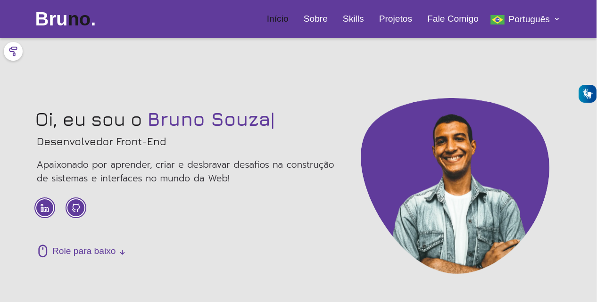

<h1 align="center">
  🚀 Portfolio Website 
</h1>

  <a href="#objetivo">Objetivo</a>&nbsp;&nbsp;&nbsp;|&nbsp;&nbsp;&nbsp;
  <a href="#tecnologias">Ferramentas</a>&nbsp;&nbsp;&nbsp;|&nbsp;&nbsp;&nbsp;
  <a href="#ideias">Ideias realizadas</a>&nbsp;&nbsp;&nbsp;|&nbsp;&nbsp;&nbsp;
  <a href="#projeto">Projeto</a>

 

  

 

<h2 id="objetivo">🔎 <b>Objetivo:</b></h2>

Criar uma solução simples, agradável e acessível, trazendo uma experiência marcante para os usuários.

- Projeto do [Bootcampinho UI/UX](https://maiane.com.br/bootcampinho-ui-ux-design/)
- Utilização dos aprendizados de UI e UX Design

<h2 id="tecnologias">🔧 <b>Ferramentas:</b></h2>

- HTML e CSS
- JavaScript
- Git e GitHub
- [npm v.8.19.2](https://www.npmjs.com/package/npm/v/8.19.2)
- [Figma](https://www.figma.com/?fuid=)
- [Bootstrap v5.0.2](https://getbootstrap.com/docs/5.0/getting-started/introduction/)
- [Unicons v4.0.0](https://iconscout.com/unicons)
- [Fancybox v4.0](https://fancyapps.com/docs/ui/fancybox/)
- [MixItUp v3.0](https://www.kunkalabs.com/mixitup/)
- [ScrollReveal v4.0.9](https://scrollrevealjs.org/)
- [Typed.js v2.0.12](https://github.com/mattboldt/typed.js/)

<h2 id="ideias">💡 <b>Ideias realizadas:</b></h2>

- [Preloader](https://github.com/vineethtrv/css-loader) -> Efeito de pré-carregamento da página
- **Switch Color** -> Personalize o site com a cor de sua escolha dentro das cinco opções possíveis
- **Dark Mode** -> Caso possua fotofobia ou deseja economizar a bateria do seu aparelho, acione essa função
- **Seletor de idiomas:**
    - Duas opções: **Português** ou **Inglês**
    - Criado para aumentar o alcance de possíveis interessados em me conhecer
- [VLibras](https://www.gov.br/governodigital/pt-br/vlibras) -> Acessibilidade digital 

<h2 id="projeto">💻 <b>Projeto:</b></h2>

- [Veja o projeto online](https://brunosouzadev.netlify.app/)

 

  Feito com 💜 por mim | Bruno Souza

